# <p style="text-align: center;">[Spatial Analyses]{style="font-size:250%; font-weight:400"}</p>

<p style="text-align: center;">[*Chapter 12*]{style="font-size:120%; font-weight:400"}</p>

As in previous weeks, for today's lab you are to create a new `RMarkdown` document using the class lab report template. Within your `.Rmd` document, include all you code, resulting plots, and answers to questions below. 

When you are done with your report, use knitr to convert it to .PDF format to submit on Canvas. 
It is important that you document each step of your workflow using comments and that you break up the sections of your analysis into SEPARATE code chunks.


**Today's investigation.** In this chapter you will learn about collection, wrangling, and visualization of spatial data

------------------------------------------------------------------------

##### [Intro to Lidar Data]{style="color:#66023C; font-size:150%; font-weight:600"}

Light Detection and Ranging (LiDAR) is an active remote sensing technique that measures vegetation height. Learn more about discrete and full waveform LIDAR and how to use LIDAR data.


After completing this tutorial, you will be able to:

- List and briefly describe the 3 core components of a lidar remote sensing system.
- Describe what a lidar system measures.
- Define an active remote sensing system.

Lidar or **Li**ght **D**etection **a**nd **R**anging is an active remote sensing system that can be used to measure vegetation height across wide areas.

<center> 

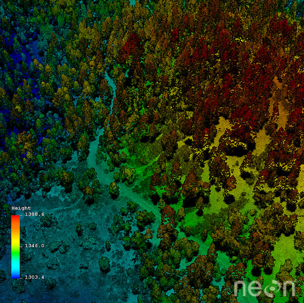

</center>

&nbsp; 

#### Why Lidar

Scientists often need to characterize vegetation over large regions. We use tools that can estimate key characteristics over large areas because we don’t have the resources to measure each individual tree. These tools often use remote methods. Remote sensing means that we aren’t actually physically measuring things with our hands, we are using sensors which capture information about a landscape and record things that we can use to estimate conditions and characteristics.

<center>

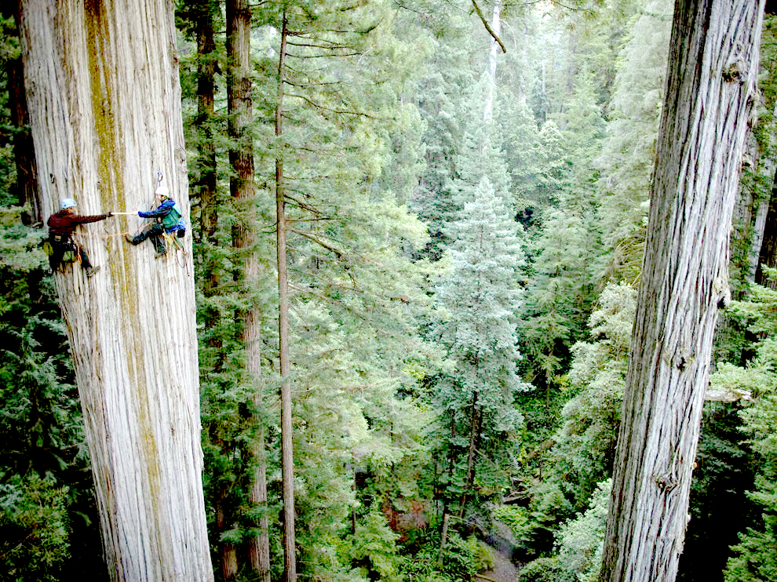
To measure vegetation across large areas we need remote sensing methods that can collect many measurements quickly using automated sensors. These measurements can be used to estimate forest structure across larger areas. Lidar (also sometimes referred to as active laser scanning) is one remote sensing method that can be used to map structure including vegetation height, density and other characteristics across a region. Lidar directly measures the height and density of vegetation (as well as buildings and other objects) on the ground making it an ideal tool for scientists studying vegetation over large areas.

</center>

&nbsp; 

<center>

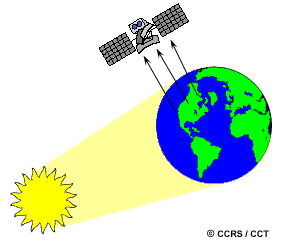

</center>

&nbsp; 

#### Lidar is an Active Remote Sensing System

Lidar is an *active remote sensing* system. An active system means that the system itself generates energy - in this case light - to measure things on the ground. In a lidar system, light is emitted from a rapidly firing laser. This light travels to the ground and reflects off of things like buildings and tree branches. The reflected light energy then returns to the lidar sensor where it is recorded.

A lidar system measures the time it takes for emitted light to travel to the ground and back. That time is used to calculate distance traveled. Distance traveled is then converted to elevation. These measurements are made using the key components of a lidar system including a GPS that identifies the X,Y,Z location of the light energy and an Internal Measurement Unit (IMU) that provides the orientation of the plane in the sky.

&nbsp; 

#### How Light Energy is Used to Measure Trees

Light energy is a collection of photons. As the photons that make up light move towards the ground, they hit objects such as branches on a tree. Some of the light reflects off of those objects and returns to the sensor. If the object is small and there are gaps surrounding it that allow light to pass through, some light continues down towards the ground. Because some photons reflect off of things like branches but others continue down towards the ground, multiple reflections may be recorded from one pulse of light.

The distribution of energy that returns to the sensor creates what we call a waveform. The amount of energy that returned to the lidar sensor is known as “intensity”. The areas where more photons or more light energy returns to the sensor create peaks in the distribution of energy. Theses peaks in the waveform often represent objects on the ground like a branch, a group of leaves or a building.

&nbsp; 

<center>


</center>

&nbsp; 

##### [How Scientists Use Lidar Data]{style="color:#66023C; font-size:150%; font-weight:600"}

There are many different uses for lidar data:

- Lidar data classically have been used to derive high resolution elevation data

&nbsp; 

<center>

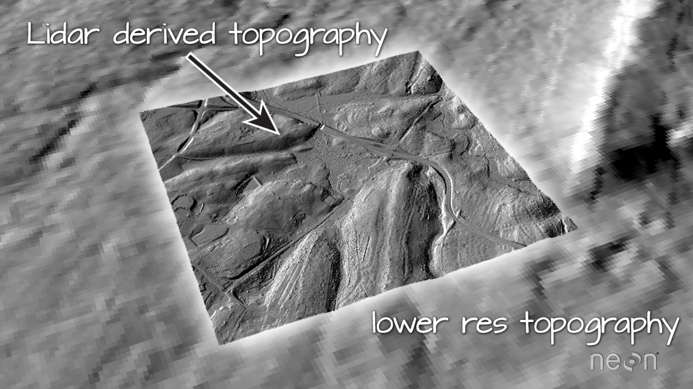

</center>

&nbsp; 

Lidar data have also been used to derive information about vegetation structure including:

- Canopy height
- Canopy cover
- Leaf area index
- Vertical forest structure
- Species identification (in less dense forests with high point density lidar)

&nbsp; 

<center>

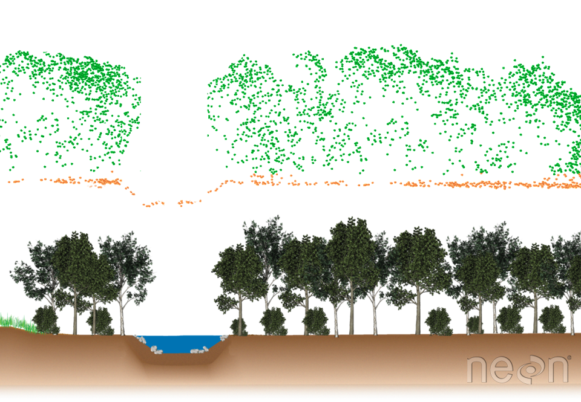

</center>

&nbsp; 

- A **discrete return lidar system** identifies individual (discrete) peaks and records a point at each peak location in the waveform curve. These discrete or individual points are called returns. A discrete system may record 1-4 (and sometimes more) returns from each laser pulse.

- A **full waveform lidar system** records a distribution of returned light energy. Full waveform lidar data are thus more complex to process, however, they can often capture more information compared to discrete return lidar systems.

&nbsp; 

##### [Lidar File Formats]{style="color:#66023C; font-size:150%; font-weight:600"}

Whether they are collected as discrete points or full waveform, most often lidar data are available as discrete points. A collection of discrete return lidar points is known as a lidar point cloud.

The commonly used file format to store lidar point cloud data is the `.las` format. The `.laz` format is a highly compressed version of `.las` and is becoming more widely used.

&nbsp; 

#### Lidar Data Attributes: X, Y, Z, Intensity and Classification

Lidar data attributes can vary, depending upon how the data were collected and processed. You can determine what attributes are available for each lidar point by looking at the metadata.

All lidar data points will have:

- **X,Y Location Information:** determines the x,y coordinate location of the object that the lidar pulse (the light) reflected off of

- **Z (elevation values):** represents the elevation of the object that the lidar pulse reflected off of

Most lidar data points will have:

- **Intensity:** represents the amount of light energy recorded by the sensor.

&nbsp; 

##### [Classified Lidar Point Clouds]{style="color:#66023C; font-size:150%; font-weight:600"}

Some lidar point cloud data will also be “classified”. Classification refers to tagging each point with the object that it reflected off of. So if a pulse reflects off of a tree branch, you would assign it to the class “vegetation.” If the pulse reflects off of the ground, you would assign it to the class “ground.” Classification of lidar point clouds is an additional processing step. Classification simply represents the type of object that the laser return reflected off of. So if the light energy reflected off of a tree, it might be classified as “vegetation”. And if it reflected off of the ground, it might be classified as “ground”.

Some lidar products will be classified as “ground/non-ground.” Some datasets will be further processed to determine which points reflected off of buildings and other infrastructure. Some lidar data will be classified according to the vegetation type.

&nbsp; 

<center>

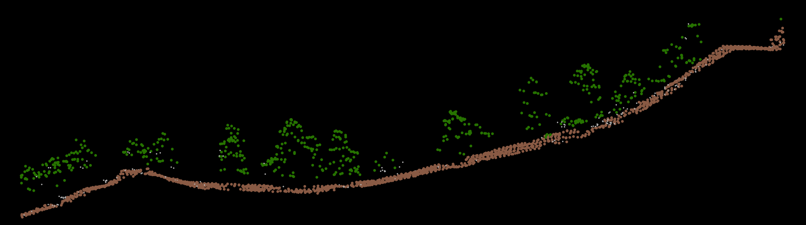

</center>

&nbsp; 

--------------------------------------------------------------------------------

<p style="text-align: center;">[Lidar Point Clouds]{style="color:darkblue; font-size:300%; font-weight:400"}</p>

The **point cloud** is one of the commonly found lidar data products and is the “native” format for discrete return lidar data. In this lesson you will explore some point cloud data using the `plas.io` viewer.

&nbsp; 

##### [Explore Lidar Points in plas.io]{style="color:#66023C; font-size:150%; font-weight:600"}

&nbsp; 

<center>

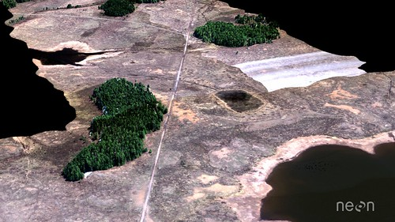

</center>

&nbsp; 

We will open a `.las` file, in the `plas.io` free online lidar data viewer. You will then explore some of the attributes associated with a lidar data point cloud.

&nbsp; 

#### Lidar Attribute Data

Remember that not all lidar data are created equally. Different lidar data may have different attributes. In this activity, you will look at data that contain both intensity values and a ground vs non ground classification.

&nbsp; 

### 1. Open a .las File in plas.io

- If you haven’t already, download the week 3 dataset - linked at the top of this page. It contains several .laz format point cloud datasets that you will use in this lesson.
- When the download is complete, drag one of the .laz files into the plas.io website. window.
- Zoom and pan around the data.
- Use the particle size slider to adjust the size of each individual lidar point. *NOTE*: the particle size slider is located a little more than half way down the plas.io toolbar in the “Data” section
If the data imported into the plas.io viewer correctly, you should see something similar to the screenshot below:

&nbsp; 

<center>

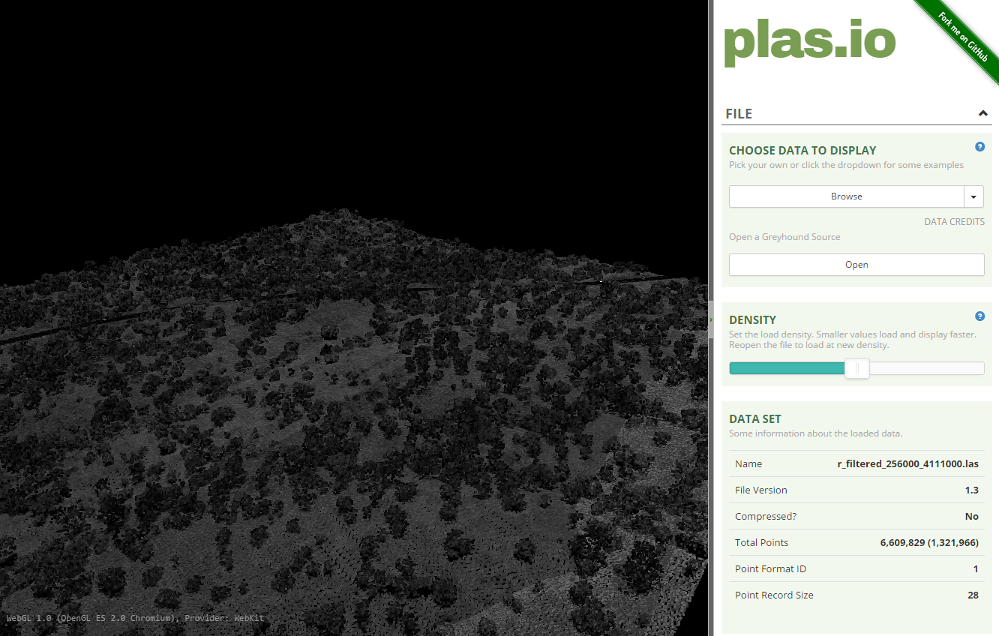

</center>

&nbsp; 

#### Navigate Around Your Data in plas.io
 
You might prefer to use a mouse to explore your data in `plas.io`. Let’s test the navigation out:

- Left click on the screen and drag the data on the screen. Notice that this tilts the data up and down
- Right click on the screen and drag noticing that this moves the entire dataset around
- Use the scroll bar on your mouse to zoom in and out

&nbsp; 

#### How the Points are Colored - Why is Everything Grey When the Data are Loaded?

Notice that the data, upon initial view, are colored in a black - white color scheme. These colors represent the data’s intensity values. Remember that the intensity value for each lidar point represents the amount of light energy that reflected off of an object and returned to the sensor. In this case, darker colors represent LESS light energy returned. Lighter colors represent MORE light returned.

&nbsp; 

<center>

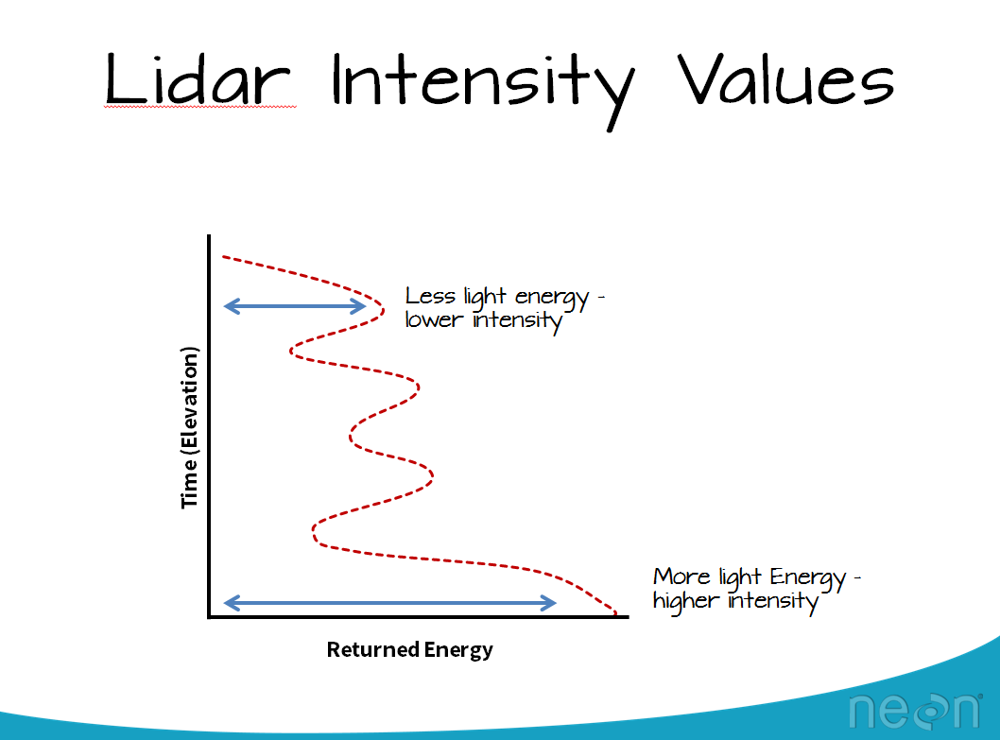

</center>

&nbsp; 

### 2. Adjust the Intensity Threshold

Next, scroll down through the tools in plas.io. Look for the Intensity Scaling slider. The intensity scaling slider allows you to define the thresholds of light to dark intensity values displayed in the image (similar to stretching values in an image processing software or even in photoshop).

Drag the slider back and forth. Notice that you can brighten up the data using the slider.

&nbsp; 

<center>

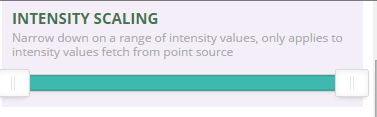

</center>

&nbsp; 

### 3. Change the Lidar Point Cloud Color Options to Classification

In addition to intensity values, these lidar data also have a classification value. Lidar data classification values are numeric, ranging from 0-20 or higher. Some common classes include:

- 0 Not classified
- 1 Unassigned
- 2 Ground
- 3 Low vegetation
- 4 Medium vegetation
- 5 High vegetation
- 6 Building

&nbsp; 

<center>

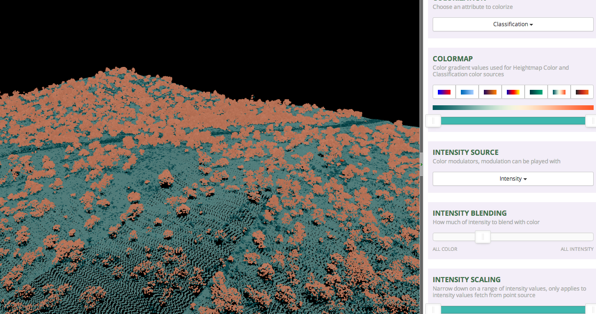

</center>

&nbsp; 

In this case, these data are classified as either ground, or non-ground. To view the points, colored by class:

- Change the “colorization” setting to “Classification””
- Change the intensity blending slider to “All Color”
- For kicks - play with the various colormap options to change the colors of the points

&nbsp; 
------------------------------------------------------------------------

##### [Gridded or Raster Lidar Data Products]{style="color:#66023C; font-size:150%; font-weight:600"}

Point clouds provide a lot of information, scientifically. However, they can be difficult to work with given the size of the data and tools that are available to handle large volumns of points. Lidar data products are often created and stored in a gridded or raster data format. The raster format can be easier for many people to work with and also is supported by many different commonly used software packages.

&nbsp; 

<center>


</center>

&nbsp; 

#### What is a Raster?

Raster or “gridded” data are stored as a grid of values which are rendered on a map as pixels. Each pixel value represents an area on the Earth’s surface. A raster file is a composed of regular grid of cells, all of which are the same size. You’ve looked at and used rasters before if you’ve looked at photographs or imagery in a tool like Google Earth. However, the raster files that you will work with are different from photographs in that they are spatially referenced. Each pixel represents an area of land on the ground. That area is defined by the spatial *resolution* of the raster.

&nbsp; 

<center>


</center>

&nbsp; 

#### Raster Facts

A few notes about rasters:

- Each cell is called a pixel.
- Each pixel represents an area on the ground.
- The resolution of the raster is the area that each pixel represents on the ground. So a 1-meter resolution raster means that each pixel represents a 1m by 1m area on the ground.

A raster dataset can have attributes associated with it as well. For instance in a lidar derived digital elevation model (DEM), each cell represents an elevation value for that location on the earth. In a lidar derived intensity image, each cell represents a lidar intensity value or the amount of light energy returned to and recorded by the sensor.

&nbsp; 

<center>


</center>

&nbsp; 

#### Creating a Raster from Lidar Point Clouds

One of the most basic ways to create a raster from lidar point clouds is called gridding. When you grid raster data, you calculate a value for each pixel or cell in your raster dataset using the points that are spatially located within that cell. To do this:

- A grid is placed on top of the lidar data in geographic space. Each cell in the grid has the same spatial dimensions. These dimensions represent that particular area on the ground. If you want to derive a 1m resolution raster from the lidar data, you overlay a 1m by 1m grid over the lidar data points.
- Within each 1m x 1m cell, you calculate a value to be applied to that cell, using the lidar points found within that cell. The simplest method of doing this is to take the max, min or mean height value of all lidar points found within the 1m cell. If you use this approach, you might have cells in the raster that don’t contain any lidar points. These cells will have a “no data” value if you process your raster in this way.

&nbsp; 

##### [Materials and Methods]{style="color:#66023C; font-size:150%; font-weight:600"}

-   R and RStudio
-   package *ggplot2*, *raster*, *sf*, and *rgeos*
-   [Download data here.](https://drive.google.com/file/d/1Fh68nMIRnhso9QOFW-BkBwszfOYaPuQz/view?usp=sharing) Unzip it and put it in your working directory. 

To work with raster data in `R`, you can use the `raster` and `sf` packages.

``` r
# load libraries
library(raster)
library(sf)
library(ggplot2)
```

You use the `raster("path-to-raster-here")` function to open a raster dataset in `R`. Note that you use the `plot()` function to plot the data. The function argument `main = ""` adds a title to the plot.

``` r
# open raster data
lidar_dem <- raster(x = "spatial/BLDR_LeeHill/pre-flood/lidar/pre_DTM.tif")

# plot raster data
plot(lidar_dem,
     main = "Digital Elevation Model - Pre 2013 Flood")
```

If you zoom in on a small section of the raster, you can see the individual pixels that make up the raster. Each pixel has one value associated with it. In this case that value represents the elevation of ground.

Note that you are using the `xlim=` argument to zoom in to on region of the raster. You can use `xlim` and `ylim` to define the x and y axis extents for any plot.

``` r
# zoom in to one region of the raster
plot(lidar_dem,
  xlim = c(473000, 473030), # define the x limits
  ylim = c(4434000, 4434030), # define y limits for the plot
     main = "Lidar Raster - Zoomed into one small region")
```

Next, let’s discuss some of the important spatial attributes associated with raster data.


##### [Coordinate Reference System]{style="color:#66023C; font-size:150%; font-weight:600"}

The coordinate reference system (`CRS`) of a spatial object tells `R` where the raster is located in geographic space. It also tells `R` what method should be used to “flatten” or project the raster in geographic space.


#### What Makes Spatial Data Line Up on a Map?

You will learn `CRS` in more detail later. For now, just know that data from the same location but saved in different coordinate references systems will not line up on a map. Thus, it’s important when working with spatial data to identify the coordinate reference system applied to the data and retain it throughout data processing and analysis.

#### View Raster CRS in R

You can view the `CRS` string associated with your `R` object using the `crs()` method. You can assign this string to an `R` object too.

``` r
# view resolution units
crs(lidar_dem)
## CRS arguments:
##  +proj=utm +zone=13 +datum=WGS84 +units=m +no_defs +ellps=WGS84
## +towgs84=0,0,0

# assign crs to an object (class) to use for reprojection and other tasks
myCRS <- crs(lidar_dem)
myCRS
## CRS arguments:
##  +proj=utm +zone=13 +datum=WGS84 +units=m +no_defs +ellps=WGS84
## +towgs84=0,0,0
```

The `CRS` string for our `lidar_dem` object tells us that your data are in the UTM projection.

&nbsp; 

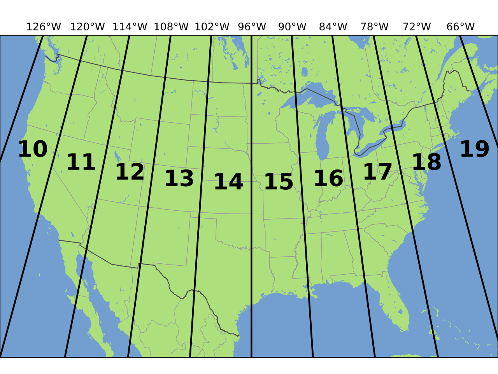

&nbsp; 

The `CRS` format, returned by `R`, is in a `PROJ 4` format. This means that the projection information is strung together as a series of text elements, each of which begins with a `+` sign.

`+proj=utm +zone=18 +datum=WGS84 +units=m +no_defs +ellps=WGS84 +towgs84=0,0,0`

&nbsp; 

You’ll focus on the first few components of the CRS in this activity:

- `+proj=utm` The projection of the dataset. Your data are in Universal Transverse Mercator (`UTM`).
- `+zone=18` The `UTM` projection divides up the world into zones, this element tells you which zone the data is in. Harvard Forest is in Zone 18.
- `+datum=WGS84` The datum was used to define the center point of the projection. Your raster uses the WGS84 datum.
- `+units=m` This is the **horizontal** units that the data are in. Your units are meters.

&nbsp; 

*Important:* You are working with lidar data which has a Z or vertical value as well. While the horizontal units often match the vertical units of a raster they don’t always! Be sure to check the metadata of your data to figure out the vertical units!

&nbsp; 

##### [Spatial Extent]{style="color:#66023C; font-size:150%; font-weight:600"}

Next, let’s discuss spatial extent. The spatial extent of a raster or spatial object is the geographic area that the raster data covers.

<center>


</center>

&nbsp; 

The spatial extent of an `R` spatial object represents the geographic “edge” or location that is the furthest north, south, east and west. In other words, `extent` represents the overall geographic coverage of the spatial object.


##### [Raster Resolution]{style="color:#66023C; font-size:150%; font-weight:600"}

A raster has horizontal (x and y) resolution. This resolution represents the area on the ground that each pixel covers. The units for your data are in meters. In this case, your data resolution is 1 x 1. This means that each pixel represents a 1 x 1 meter area on the ground. You can figure out the units of this resolution using the `crs()` function which you will use next.

``` r
# what is the x and y resolution for your raster data?
xres(lidar_dem)
## [1] 1
yres(lidar_dem)
## [1] 1
```

<center> 


</center> 

&nbsp; 

#### Resolution Units

Resolution as a number doesn’t mean anything unless you know the units. You can figure out the horizontal (x and y) units from the coordinate reference system string using `crs()`.

Notice the output contains an element called `units=m`. This means the units are in meters. We won’t get into much detail about coordinate reference strings in this  class but they are important to be familiar with when working with spatial data. 

&nbsp; 

Let's plot our raster data. 

``` r
# plot raster data
plot(lidar_dem,
     main = "Digital Elevation Model - Pre 2013 Flood")
```

&nbsp; 

We can also pull the data from the raster, such as elevation, and plot it in traditional graphs, such as a histogram. 
A histogram of elevations represents the distribution of pixel elevation values in your data. 
This plot is useful to:

- Identify outlier data values.
- Assess the min and max values in your data.
- Explore the general distribution of elevation values in the data (i.e. is the area generally flat, hilly, high elevation or low elevation).

``` r
# plot histogram
hist(lidar_dem,
     main = "Distribution of surface elevation values",
     xlab = "Elevation (meters)", ylab = "Frequency",
     col = "springgreen")
```

Notice that you are using the `xlab` and `ylab` arguments in your plot to label your plot axes.

&nbsp; 

**Questions:**
1. What does the histogram tell you?

2. 

- a. Use the `breaks = ` to make larger bins. Enter the command `??hist()` to read the help manual for the hist() function if you need more information. 

- b. Now specify that you want breaks at 1600, 1800, 2000, 2100. Be sure to include your plotting code and plots in your report. 

&nbsp; 

<p style="text-align: center;">[Vector Data]{style="color:darkblue; font-size:300%; font-weight:400"}</p>

Vector data are composed of discrete geometric locations (x,y values) known as vertices that define the “shape” of the spatial object. The organization of the vertices determines the type of vector that you are working with: point, line or polygon.

<center>


</center>

&nbsp; 

- **Points:** Each individual point is defined by a single x, y coordinate. There can be many points in a vector point file. Examples of point data include: sampling locations, the location of individual trees or the location of plots.
- **Lines:** Lines are composed of many (at least 2) vertices, or points, that are connected. For instance, a road or a stream may be represented by a line. This line is composed of a series of segments, each “bend” in the road or stream represents a vertex that has defined x, y location.
- **Polygons:** A polygon consists of 3 or more vertices that are connected and “closed”. Thus the outlines of plot boundaries, lakes, oceans, and states or countries are often represented by polygons. Occasionally, a polygon can have a hole in the middle of it (like a doughnut), this is something to be aware of but not an issue you will deal with in this tutorial.

&nbsp; 

##### [Shapefiles: Points, Lines, and Polygons]{style="color:#66023C; font-size:150%; font-weight:600"}

Geospatial data in vector format are often stored in a shapefile format. Because the structure of points, lines, and polygons are different, each individual shapefile can only contain one vector type (all points, all lines or all polygons). You will not find a mixture of point, line and polygon objects in a single shapefile.

Objects stored in a shapefile often have a set of associated `attributes` that describe the data. For example, a line shapefile that contains the locations of streams, might contain the associated stream name, stream “order” and other information about each stream line object.

&nbsp; 

#### Import Shapefiles

The shapefiles that you will import are:

- A polygon shapefile representing your field site boundary.
- A line shapefile representing roads.
- A point shapefile representing the location of field sites located at the San Joachin field site.
The first shapefile that you will open contains the point locations where trees have been measured at the study site. The data are stored in shapefile format. To import shapefiles you use the `R` function `read_sf()`.

&nbsp; 

`read_sf()` requires two components:

- The directory where your shapefile lives
- The name of the shapefile (without the extension): `SJER_plot_centroids`.
You can call each element separately

`read_sf("path","fileName")`

&nbsp; 

Or you can simply include the entire path to the shp file in the path argument. Both ways to open a shapefile are demonstrated below:

``` r
# Import a polygon shapefile: read_sf("path","fileName")
sjer_plot_locations <- read_sf(dsn = "spatial/california/SJER/vector_data",
                               "SJER_plot_centroids")
```

&nbsp; 

##### [Shapefile Metadata & Attributes]{style="color:#66023C; font-size:150%; font-weight:600"}

When you import the `SJER_plot_centroids` shapefile layer into `R` the `readOGR()` function automatically stores information about the data. You are particularly interested in the geospatial **metadata**, describing the format, `CRS`, `extent`, and other components of the vector data, and the **attributes** which describe properties associated with each individual vector object.

&nbsp; 

#### Spatial Metadata

Key metadata for all shapefiles include:

- **Object Type:** the class of the imported object.
- **Coordinate Reference System (CRS):** the projection of the data.
- **Extent:** the spatial extent (geographic area that the shapefile covers) of the shapefile. Note that the spatial extent for a shapefile represents the extent for ALL spatial objects in the shapefile.

&nbsp; 

You can view shapefile metadata using the class, crs and extent methods:

``` r
# view just the class for the shapefile
class(sjer_plot_locations)

# view just the crs for the shapefile
crs(sjer_plot_locations)

# view just the extent for the shapefile
extent(sjer_plot_locations)

# view all metadata at same time
sjer_plot_locations

```

&nbsp; 

#### Spatial Data Attributes

Each object in a shapefile has one or more attributes associated with it. Shapefile attributes are similar to fields or columns in a spreadsheet. Each row in the spreadsheet has a set of columns associated with it that describe the row element. In the case of a shapefile, each row represents a spatial object - for example, a road, represented as a line in a line shapefile, will have one “row” of attributes associated with it. These attributes can include different types of information that describe objects stored within a shapefile. Thus, your road, may have a name, length, number of lanes, speed limit, type of road and other attributes stored with it.

<center>


</center>

&nbsp; 

You view the attributes of a `SpatialPointsDataFrame` using `objectName@data` (e.g., `sjer_plot_locations@data`).


**Questions:**

3. What is the class and CRS of the polygon object `sjer_plot_locations`?
4. How many attribues does the polygon object `sjer_plot_locations` have?

&nbsp; 

##### [Plot a Shapefile]{style="color:#66023C; font-size:150%; font-weight:600"}

Let’s visualize the data in your `R` `spatialpointsdataframe` object using `plot()`.

``` r
# create a plot of the shapefile
# 'pch' sets the symbol
# 'col' sets point symbol color
plot(sjer_plot_locations$geometry, col = "blue",
     pch = 8)
title("SJER Plot Locations\nMadera County, CA")
```

&nbsp; 

##### [Coordinate Reference System and Spatial Projection]{style="color:#66023C; font-size:150%; font-weight:600"}

A coordinate reference system (CRS) refers to the way in which spatial data that represent the earth’s surface (which is round / 3 dimensional) are flattened so that you can “Draw” them on a 2-dimensional surface. However each using a different (sometimes) mathematical approach to performing the flattening resulting in different coordinate system grids (discussed below). These approaches to flattening the data are specifically designed to optimize the accuracy of the data in terms of length and area (more on that later too).

&nbsp; 

<center> 


</center> 

&nbsp; 

To define the location of something you often use a coordinate system. This system consists of an X and a Y value located within a 2 (or more) -dimensional space.

<center> 

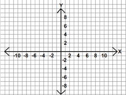

</center> 

&nbsp; 

While the above coordinate system is 2-dimensional, we live on a 3-dimensional earth that happens to be “round”. To define the location of objects on the Earth, which is round, you need a coordinate system that adapts to the Earth’s shape. When you make maps on paper or on a flat computer screen, you move from a 3-Dimensional space (the globe) to a 2-Dimensional space (your computer screens or a piece of paper). The components of the CRS define how the “flattening” of data that exists in a 3-D globe space. The CRS also defines the the coordinate system itself.


To define the location of something you often use a coordinate system. This system consists of an X and a Y value located within a 2 (or more) -dimensional space.

<center> 


</center> 


&nbsp; 


#### The Components of a CRS

The coordinate reference system is made up of several key components:

- **Coordinate system:** The X, Y grid upon which your data is overlayed and how you define where a point is located in space.
- **Horizontal and vertical units:** The units used to define the grid along the x, y (and z) axis.
- **Datum:** A modeled version of the shape of the Earth which defines the origin used to place the coordinate system in space. You will learn this further below.
- **Projection Information:** The mathematical equation used to flatten objects that are on a round surface (e.g. the Earth) so you can view them on a flat surface (e.g. your computer screens or a paper map).

&nbsp; 

*Data Tip:* spatialreference.org provides an excellent online library of CRS information.

&nbsp; 

#### Why CRS is Important

It is important to understand the coordinate system that your data uses - particularly if you are working with different data stored in different coordinate systems. If you have data from the same location that are stored in different coordinate reference systems, they will not line up in any GIS or other program unless you have a program like `ArcGIS` or `QGIS` that supports projection on the fly. Even if you work in a tool that supports projection on the fly, you will want to all of your data in the same projection for performing analysis and processing tasks.

&nbsp; 

#### Coordinate System & Units

You can define a spatial location, such as a plot location, using an x- and a y-value - similar to your cartesian coordinate system displayed in the figure, above.

For example, the map below, generated in `R` with `ggplot2` shows all of the continents in the world, in a *Geographic Coordinate Reference System*. The units are degrees and the coordinate system itself is latitude and longitude with the `origin` being the location where the equator meets the central meridian on the globe (0,0).

*Coding Tip:* You can set your own custom theme and use it in all your ggplots. Here is one you can try out for subsequent plots. 

&nbsp; 

``` r
# turn off axis elements in ggplot for better visual comparison
newTheme <- list(theme(line = element_blank(),
      axis.text.x = element_blank(),
      axis.text.y = element_blank(),
      axis.ticks = element_blank(), # turn off ticks
      axis.title.x = element_blank(), # turn off titles
      axis.title.y = element_blank(),
      legend.position = "none")) # turn off legend
```

Now let's read the shape file and plot the map:

``` r
# read shapefile
worldBound <- read_sf(dsn = "global/ne_110m_land/ne_110m_land.shp")

# plot map using ggplot
worldMap <- ggplot(worldBound) +
  geom_sf(fill = "black") +
  labs(x = "Longitude (Degrees)",
       y = "Latitude (Degrees)",
      title = "Global Map - Geographic Coordinate System",
      subtitle = "WGS84 Datum, Units: Degrees - Latitude / Longitude")

worldMap
```

&nbsp; 


You are able to add points to your map. Note that the UNITS are in decimal degrees (latitude, longitude):

- Boulder, Colorado: 40.0274, -105.2519
- Oslo, Norway: 59.9500, 10.7500
- Mallorca, Spain: 39.6167, 2.9833

&nbsp; 

Let’s create a second map with the locations overlayed on top of the continental boundary layer.

``` r
# define locations of Boulder, CO, Mallorca, Spain and  Oslo, Norway
# store coordinates in a data.frame
loc_df <- data.frame(lon = c(-105.2519, 10.7500, 2.9833),
                lat = c(40.0274, 59.9500, 39.6167))

# add a point to the map
mapLocations <- worldMap +
                geom_point(data = loc_df,
                aes(x = lon, y = lat, group = NULL), colour = "springgreen",
                      size = 5)

mapLocations

```

&nbsp; 

**Questions:**

5. In your own words, define what a Coordinate Reference System (CRS) is.
What are the key components that make up a CRS?

6. If you are working with two datasets that are stored using difference CRSs, and want to process or plot them, what do you need to do to ensure that they line up on a map and can be processed together?

7. In R, how do you check to see if two datasets are in the same CRS?

&nbsp; 

#### More Plotting

We will need a few more packages for the next plots. 

``` r
library(broom)
library(RColorBrewer)
library(dplyr)
# to add a north arrow and a scale bar to the map
library(ggsn)
# set factors to false
options(stringsAsFactors = FALSE)
```

Next, import and explore the data.

``` r
# import roads
sjer_roads <- read_sf("california/madera-county-roads/tl_2013_06039_roads.shp")
```

View attributes of and plot the data.

``` r
# view the original class of the TYPE column
class(sjer_roads$RTTYP)
unique(sjer_roads$RTTYP)

# quick plot using base plot
plot(sjer_roads,
     main = "Quick plot of roads data")
```

It looks like you have some missing values in your road types. You want to plot all road types even those that are `NA.` Let’s change the roads with an `RTTYP` attribute of `NA` to “unknown”.

``` r
# set all NA values to "unknown" so they still plot
sjer_roads$RTTYP[is.na(sjer_roads$RTTYP)] <- "Unknown"
unique(sjer_roads$RTTYP)
```

&nbsp; 

``` r
# plot the lines data
ggplot() +
  geom_path(data = sjer_roads_df, aes(x = long, y = lat, group = group)) +
  labs(title = "ggplot map of roads")
```

You can color each line by type too by adding the attribute that you wish to use for categories or types to the `color = argument`.

Below you set the colors to `color = factor(RTTYP)`. Note that you are coercing the attribute `RTTYP` to a factor. You can think of this as temporarily grouping the data by the `RTTYP` category for plotting purposes only. You aren’t modifying the data you are just telling `ggplot` that the data are categorical with explicit groups.

```r
# plot the lines data
ggplot() +
  geom_sf(data = sjer_roads, aes(color = factor(RTTYP))) +
labs(color = 'Road Types', # change the legend type
     title = "Roads colored by the RTTP attribute")
```

&nbsp; 

##### [Adding Points and Lines to a Legend]{style="color:#66023C; font-size:150%; font-weight:600"}


Next, let’s add points to your map and and of course the map legend too. You will import the shapefile `california/SJER/vector_data/sjer_plot_centroids.shp` layer. This data represents study plot locations from your field work in southern California.

Let’s import that data and perform any cleanup that is required.


``` r
# import points layer
sjer_plots <- read_sf("spatial/california/SJER/vector_data",
                      "SJER_plot_centroids")
# given you want to plot 2 layers together, let's check the crs before going any further
crs(sjer_plots)
crs(sjer_roads)

sjer_plots <- st_transform(sjer_plots, crs(sjer_roads))s
```

&nbsp; 

Next, let’s plot the data using `ggplot.`

``` r
# plot point data using ggplot
ggplot(sjer_plots) +
  stat_sf_coordinates() +
  labs(title = "Plot locations")
```

Great! You’ve now plotted your data using `ggplot.` Let’s next combine the roads with the points in one clean map.

&nbsp; 

#### Layering Data in ggplot

You can layer multiple `ggplot` objects by adding a new `geom_` function to your plot. For the roads data, you used `geom_path()` and for points you use `geom_point()`. Note that you add an addition data layer to your `ggplot` map using the `+` sign.

``` r
# plot lines and points together
ggplot() +
  geom_sf(data = sjer_roads, color = "grey") +
  labs(title = "ggplot map of roads") + 
  stat_sf_coordinates(data = sjer_plots) 
```

&nbsp; 

Your roads layer is a much larger spatial extent compared to your plots layer. To zoom in on your plots on the map, crop the map using `+ coord_sf()`. Run `??coord_sf()` for more information 

&nbsp; 

##### [ **Stop, Think, Do:**]{style="color:#66023C; font-size:100%; font-weight:600"} 

Create a map of Madera County roads with a legend:

Import the `california/madera-county-roads/tl_2013_06039_roads.shp` layer located in this week's data download.

Create a map that shows the madera roads layer, sjer plot locations and the `sjer_aoi` boundary (`sjer_crop.shp`).

Plot the roads so different road types are represented using unique symbology.
Map the plot locations by the attribute plot type using unique symbology for each “type”.

Add a title to your plot.

Adjust your plot legend.

*IMPORTANT:* be sure that all of the data are within the same `extent` and `crs` of the `sjer_aoi` layer. This means that you may have to crop and reproject your data prior to plotting it!


**Great Work!**

This lab activity was originally written by [https://www.earthdatascience.org/courses/earth-analytics/spatial-data-r/](https://www.earthdatascience.org/courses/earth-analytics/spatial-data-r/) and modified by Jenna Ekwealor.

------------------------------------------------------------------------


