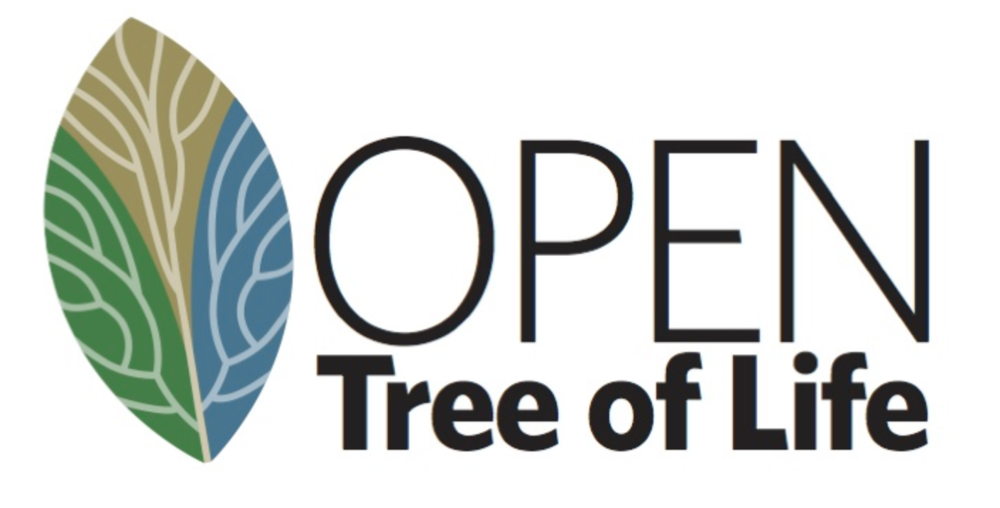
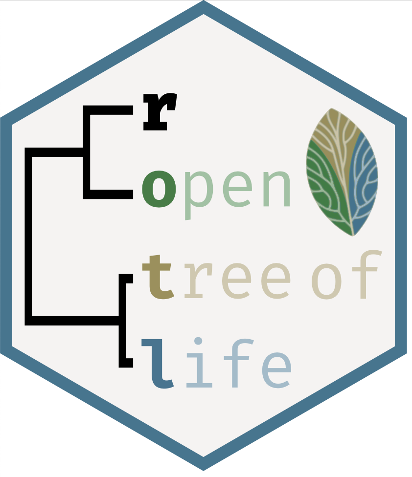
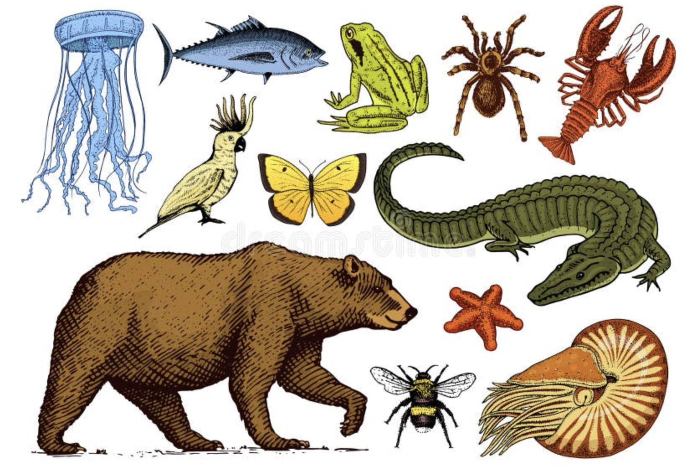

<p style="text-align: center;">[Phylogenetic Trees with Open Tree of Life]{style="font-size:250%; font-weight:400"}</p>

<p style="text-align: center;">[*Chapter 13*]{style="font-size:120%; font-weight:400"}</p>

&nbsp;

As in previous weeks, for today's lab you are to create a new `RMarkdown` document using the class lab report template. Within your `.Rmd` document, include all you code, resulting plots, and answers to questions below. 

When you are done with your report, use knitr to convert it to .PDF format to submit on Canvas. 
It is important that you document each step of your workflow using comments and that you break up the sections of your analysis into SEPARATE code chunks.

&nbsp;

# **Today's investigation** 

In this chapter you will experiment with using the Open Tree of Life in `R`. This Chapter was adapted from a tutorial by Luna L. Sanchez Reyes and Emily Jane McTavish. 

&nbsp;

##### [Materials and Methods]{style="color:#66023C; font-size:150%; font-weight:600"}

-   R and RStudio
-   package *rotl*, *ape*, *devtools*, *stringr*, *phytools*, and *tidyverse*

&nbsp;

------------------------------------------------------------------------

##### [Packages and reproducibility]{style="color:#66023C; font-size:150%; font-weight:600"}

From within `R`, install the packages `rotl`, `ape`, `devtools` and `stringr` with the function `install.packages()`, and the package `datelife` with the function `install_github()`.

Load them into your workspace with `library()` or `require()`.

When in doubt, follow the code chunk below.

Hint: If you do not want to load the packages, you can call functions specifying their package using two colons and the syntax `package_name::function_name()`.

This implies more typing, but gives more clarity to reproduce the workflow later. So we will use that syntax for this tutorial.

An exception to this, are functions from packages that are “preloaded” –such as `library()` from base, or `install.packages()` from `utils`; all these can simply be called by their name.

First install these packages by running the following command in the *console* (usually in the botom left panel in RStudio). 

```
packages <- c("rotl", "ape", "devtools", "stringr")
install.packages(packages)
devtools::install_github("phylotastic/datelife")
devtools::install_github("phylotastic/datelifeplot")
```

&nbsp;

``` r
library(rotl)
library(stringr)
library(datelife)
library(datelifeplot)
library(tidyverse)
library(phytools)
```

&nbsp;

##### Scientific reproducibility

Scientific reproducibility is key for the advancement of Science. In this first episode, we will check that you have the same package versions that we will use throughout the tutorial.

We will use the function packageVersion from the utils package to register the package version we are using for this tutorial. It only takes a single element character vector as input, so you will have to type the function and the package name each time, as follows:

``` r
packageVersion("rotl")
packageVersion("ape")
packageVersion("devtools")
packageVersion("stringi")
packageVersion("datelife")
packageVersion("datelifeplot")
packageVersion("phytools")
```

&nbsp;

Alternatively, you can create a character vector of package names and use an `lapply` to get versions of all packages at once:

``` r 
packages <- c("rotl", "ape", "devtools", "stringr", "datelife", "datelifeplot")
names(packages) <- packages

lapply(packages, packageVersion)
```
You'll want to keep track of versions for your own purposes and also for reporting which version you used when you share your methods and results. 

&nbsp;

It is also useful to also print the `R` session info with `sessionInfo`:

``` r
sessionInfo()
```

&nbsp;

This shows you what version of `R` itself you're using, as well as what packages are loaded. 

&nbsp;

<p style="text-align: center;">[Open Tree of Life Taxonomy]{style="color:darkblue; font-size:300%; font-weight:400"}</p>

&nbsp; 

<center> 

{width=50%}

</center>

&nbsp; 

The <a href="https://tree.opentreeoflife.org/about/taxonomy-version/ott3.2">Open Tree of Life Taxonomy</a> (OTT from now on) synthesizes taxonomic information from different sources and assigns each taxon a unique numeric identifier, which we refer to as the OTT id. To interact with the OTT (and any other Open Tree of Life services) using `R`, we will learn how to use the functions from the `rotl` package.

&nbsp;

<center> 

{width=30%}

</center>

&nbsp; 

To deal with synonyms and scientific name misspellings, the Open Tree Taxonomy uses the <a href="https://tnrs.biendata.org">Taxonomic Name Resolution Service</a>, that allows linking scientific names to a unique OTT id, while dealing with misspellings, synonyms and scientific name variants. The functions from rotl that interact with OTT’s TNRS start with “tnrs_”.

&nbsp;

#### Get OTT ids for a taxon

To get OTT ids for a `taxon` or set of `taxa` (e.g a species, genus, family, or some other taxonomic level) we will use the function `tnrs_match_names()`. This function takes a character vector of one or more scientific names as main argument.

Do a `tnrs_match_names()` run for the amphibians (Amphibia). Save the output to an object named `resolved_name.`
Try different misspellings and synonyms of your taxon to see TNRS in action.

``` r
resolved_name <- rotl::tnrs_match_names(names = "amphibian")
resolved_name
```
&nbsp;

Once you are comfortable with running the function `tnrs_match_names`, move on to explore the structure of the output.

&nbsp;

#### The ‘match_names’ object

As we can tell from the data printed to screen, the output of the `tnrs_match_names` function is some sort of a data table. In `R` (and all object-oriented programmming languages), defined data structures called classes are assigned to objects. This makes data manipulation and usage of objects across different functions much easier. Redundantly, a class is defined as a data structure that is the same among all objects that belong to the same class. However, we can do more to understand the structure of any class. To get the name of the class of the `tnrs_match_names()` output, we will use the function class.

``` r
class(resolved_name)
```
As you can see, an object can belong to one or more classes.

Indeed, R is telling us that the output of `tnrs_match_names()` is a data frame (a type of table) and a ‘match_names’ object, which is in turn a data frame with exactly 7 named columns: `search_string`, `unique_name`, `approximate_match`, `ott_id`, `is_synonym`, `flags`, and `number_matches.`

&nbsp;

Next, we will explore the kinds of data that are stored in each of the columns of a ‘match_names’ object.

&nbsp;

#### Kinds of data stored in a ‘match_names’ object

You should have a good idea by now of what type of data is stored in the `ott_ids` column.

&nbsp;

**Questions:**

1. Can you guess what type of data is displayed in the column `search_string` and `unique_name`?

2. How about `is_synonym`?

&nbsp;

The column `approximate_match` tells us whether the unique name was inferred from the search string using approximate matching (TRUE) or not (FALSE).

Finally, the `flags` column tells us if our unique name has been flagged in the OTT (TRUE) or not (FALSE). It also indicates the type of flag associated to the taxon. Flags are markers that indicate if the taxon in question is problematic and should be included in further analyses of the Open Tree workflow. You can read more about flags in the <a href="https://github.com/OpenTreeOfLife/reference-taxonomy/wiki/Taxon-flags">Open Tree wiki</a>.

Now we know what kind of data is retrieved by the `tnrs_match_names()` function. Pretty cool!

&nbsp;

#### Get OTT ids for multiple taxon names at a time

Now that we know about classes and the data structure of the `tnrs_match_names` output, we will learn how to use the `tnrs_match_names` function for multiple taxa. In this case, you will have to create a character vector with your taxon names and use it as input for `tnrs_match_names`:

&nbsp;

Do a `tnrs_match_names()` run for the amphibians (Amphibia), the genus of the cat (*Felis*), the family of dolphins (Delphinidae), and the class of birds (Aves). Save the output to an object named `resolved_names.`

&nbsp;

<center> 

{width=50%}

</center>

&nbsp;

Again, you can try different misspellings and synonyms of your taxa to see TNRS in action.

``` r
my_taxa <- c("amphibians", "felis", "canis, "delphinidae", "aves", "primates")
resolved_names <- rotl::tnrs_match_names(names = my_taxa, context_name = "All life")
resolved_names
```

&nbsp;

You should get a matched named for all the taxa in this example. If you do not get a match for all your taxa, and you get an unexpected warning message, it means that the `tnrs_match_names` function might not be working as expected. 

&nbsp;

Next, we are going to learn how to extract specific pieces of data from a ‘match_names’ object to use in other functions and workflows.

&nbsp;

#### Extracting data from a ‘match_names’ object

It is easy to access elements from a ‘match_names’ object using it's column name, like this:

``` r
resolved_names$unique_name
```

The ‘match_names’ object has a relatively simple structure that is easy to explore and mine. We will see later that the outputs of other `rotl` functions are more complicated and accessing their elements requires a lot of hacking. Fortunately, the rotl creators have added some functions that allow interacting with these complicated outputs. The functions `unique_name()`, `ott_id()`, and `flags()` extract values from the respective columns of a ‘match_names’ object, in the form of a list instead of a vector. To extract data from the other columns there are no specialized functions, so you will have to index.

&nbsp;

[Challenge 1]{style="color:#66023C; font-size:150%; font-weight:600"}

You now have a ‘match_names’ object that we called `resolved_names.` Extract the OTT ids from it and store them in an object we will call `my_ott_ids`.

*Hint:* use your knowledge on data frames and tables to extract the data from the `ott_id` column.

&nbsp;

If you just want to look a partiular row, you can use the `inspect()` function from rotl

``` r
rotl::inspect(resolved_names, taxon_name = "Delphinidae")
```

&nbsp;

[Challenge 2]{style="color:#66023C; font-size:150%; font-weight:600"}

Can you think of another way to extract the *Delphinidae* row? 

*Hint:* consider using data frame wrangling from the `tidyverse` package. 

&nbsp;

Now you know how to get OTT ids from a bunch of taxa of interest. Next, we'll explore what exactly you can do with these. 

&nbsp;

------------------------------------------------------------------------

<p style="text-align: center;">[Building a Synthetic Tree]{style="color:darkblue; font-size:300%; font-weight:400"}</p>

&nbsp;

The synthetic Open Tree of Life (**synthetic OpenTree** from now on) summarizes information from trees from peer-reviewed and published studies that have been uploaded to the OpenTree database (the Phylesystem) through a <a href="https://tree.opentreeoflife.org/curator">curator system</a>.

Functions from the `rotl` package that interact with the synthetic OpenTree start with `tol_`.

To access general information about the current synthetic OpenTree, we can use the function `tol_about()`. This function requires no argument.

``` r 
rotl::tol_about()
```

&nbsp;

**Question:**

3. How many trees, studies, and tips (terminal taxa) are in the current version of OpenTree?

&nbsp;

The tree is huge! So, what if we just want a small piece of the whole synthetic OpenTree? Well, now that we have some interesting taxon OTT ids, we can easily do this.

&nbsp;

#### Induced subtrees

The function `tol_induced_subtree()` allows us to get a tree of taxa from different taxonomic ranks.

``` r
resolved_names$ott_id
my_tree <- rotl::tol_induced_subtree(ott_ids = resolved_names$ott_id)
```

&nbsp;

Let’s look at the output of `tol_induced_subtree()`.

``` r
my_tree
```

&nbsp;

`R` is telling us that we have a rooted tree with no branch lengths and 5 tips. If we check the class of the output, we will verify that it is a **‘phylo’ object**.

``` r
class(my_tree)
```

&nbsp;

A ‘phylo’ object is a data structure that stores the necessary information to build a tree. There are several functions from different packages to plot trees or ‘phylo’ objects in `R` (e.g., `phytools`). For now, we will use the one from the legendary ape package `plot.phylo()`:

``` r
ape::plot.phylo(my_tree, cex = 2) # or just plot(my_tree, cex = 2)
```

&nbsp;

This is cool! 

Now, *what if you want a piece of the synthetic OpenTree containing all descendants of your taxa of interest?*

&nbsp;

#### Subtree of one taxon

We can extract a subtree of all descendants of one taxon at a time using the function `tol_subtree()` and an OTT id of your choosing. Let’s extract a subtree of all amphibians.

&nbsp;

First, get its OTT id. It is already stored in our `resolved_names` object:

``` r
amphibia_ott_id <- resolved_names %>% dplyr::filter(unique_name == "Amphibia") %>% select(ott_id)
amphibia_ott_id
```

&nbsp;

Now, extract the subtree from the synthetic OpenTree using `tol_subtree()`.

``` r
amphibia_subtree <- rotl::tol_subtree(ott_id = amphibia_ott_id$ott_id)
```

&nbsp;

Let’s look at the output:

``` r
amphibia_subtree
```
This is a large tree! We will have a hard time plotting it.

&nbsp;

We can extract and plot a subtree for the genus *Felis* It should be way smaller!

``` r
subtree <- rotl::tol_subtree(resolved_names["Felis",]$ott_id)
ape::plot.phylo(subtree)
```

&nbsp;

##### [Get an induced subtree of all taxa within a taxonomic rank]{style="color:#66023C; font-size:150%; font-weight:600"}

There is not a specific function in the package `rotl` that gets all taxa from a given taxonomic rank. We will now shift to the `datelife` package and use the `get_ott_children()` function, that extracts OTT ids of all taxa from a rank specified by the argument `ott_rank.`

&nbsp;

Let’s get all amphibian families.

``` r 
amphibia_families <- datelife::get_ott_children(ott_ids = amphibia_ott_id$ott_id, ott_rank = "family")
class(amphibia_families)
```
Note that amphibia_families (resulting from `datelife::get_ott_children()`) is a list. One good way to explore lists is to view it in RStudio. Enter the following `View()` command into the console. 

``` 
View(amphibia_families)
```

&nbsp;

Now we can get the induced subtree using the amphibian families’ OTT ids.

&nbsp;

[Challenge 3]{style="color:#66023C; font-size:150%; font-weight:600"}

Explore `View(amphibia_families)` and you'll see that the OTT IDs are nested in the list structure. There are at least two different ways to extract them from the list, see if you can figure one out to generate the Amphibia subtree:

``` r
amphibia_families_subtree <- rotl::tol_induced_subtree(<insert ott ids here>)
```

&nbsp;

**Questions:** 

4. What is the structure of `amphibia_families`? Explain. 

5. How many tips does the amphibian families phylo object (tree) have?

6. Plot the amphibian families tree! Look at the arguments of function `tol_induced_subtree()` with `??tol_induced_subtree()` to plot without OTT IDs in the tip labels. 

&nbsp;

##### [Synthesizing a timetree]{style="color:#66023C; font-size:150%; font-weight:600"}

Say you are interested in understanding and visualizing the time frame in which the tips and ancestors on your tree diverged and diversified. 
Standard phylogenetic trees are generally **phylograms**, in which branch lengths correspond to divergence (*i.e.* how much change has occurred since the branches split from a common ancestor). 
To know how much *time* has passed since branches or species split from a common ancestor, a model (such as a molecular clock model) must be applied to convert the phylogram into a **chronogram** (also known as a **timetree**.

In `rotl`, you can search the chronogram database to try and build a synthetic chronogram of your taxon of interest. 

&nbsp;

#### Search the OpenTree chronogram database using datelife

Let's build a synthetic chronogram of *Canis*.

First, we need to find the OTT ID of the most recent common ancestor (MRCA) of *Canis.*

``` r
canis_node_info <- rotl::tol_node_info(canis_ott_id$ott_id)
canis_mrca <- canis_node_info[["node_id"]] # this will get us the actual ID itself rather than data frame or a list
```

&nbsp;

In the package `datelife`, we have implemented a workflow that extracts all studies containing information from at least two taxa. You can get all source chronograms from an induced subtree, as long as the tip labels are in the “name” format (and not the default “name_and_id”).

`datelife` takes as input either a tree with tip labels as scientific names (and not names and ids), or a vector of scientific names.

Get a *Canis* subtree with tip labels that do not contain the OTT id.

``` r
canis_node_subtree <- rotl::tol_subtree(node_id = canis_mrca, label = "name")
canis_node_subtree
```

&nbsp;

Now, you can use that tree as input for the `get_datelife_result()` function.

``` r
canis_dr <- datelife::get_datelife_result(canis_node_subtree)
```
We have now a list of matrices storing time of lineage divergence data for all taxon pairs. Lists are named with the study citation, so we have that information handy at all times.

&nbsp;

Let’s explore the output.

``` r 
class(canis_dr)
```

&nbsp;

Notice `canis_dr` is class *list*. Lists are very useful data formats in `R`! RStudio makes it easy to click around the list object and see what it contains. Try this:

``` 
View(canis_dr)
```

&nbsp;

To access elements of a list, you can either use indexing (the numerical position in the list) or, if the elements are named, the name. Let's look at the first element of the `canis_dr` list. 

``` r
canis_dr[1]
```

&nbsp;

A shortcut to look at the last element of the list is to take advantage of the function `length()`.

``` r
canis_dr[length(canis_dr)]
 ```

&nbsp;

#### Retrieve and plot your chronograms

Then, it is really easy to go from a matrix to a tree, using the function `summarize_datelife_result()` with the option `summary_format = "phylo_all"`. Note the printed output returns a summary of taxa that have branch length information in the database.


``` r
canis_phylo_all <-  datelife::summarize_datelife_result(canis_dr, summary_format = "phylo_all")
```

&nbsp;

To plot the resulting tree, you can use the `plot.phylo()` function from `ape.` You can also use `datelifeplot` functions, such as `plot_phylo_all()` in the Console for an interactive plot that adds the study citation as title, as well as a geo-chrono-stratigraphic axis for a time reference.

Run the following in the console: 

``` 
datelifeplot::plot_phylo_all(chronograms = canis_phylo_all, plot_height = 4, plot_width = 6)
```

&nbsp;

Plot each tree sparately using list indexing. 

``` r
ape::plot.phylo(canis_phylo_all[<insert a number here>])
```

&nbsp;

Now that we have a collection of chronograms containing our taxa of interest, we can go on to summarize the information in them into a single chronogram.

There is no consensus on the best way to do this, but the fastest one is using the median of node ages for each node with available information, and then evenly distributing ages across nodes.

``` r
canis_phylo_median <-  datelife::summarize_datelife_result(canis_dr, summary_format = "phylo_median")
```

&nbsp;

Now plot your chronogram!

``` r
ape::plot.phylo(canis_phylo_median, cex = 1.2)

# Add the time axis:
ape::axisPhylo()

# And a little hack to add the axis name:
graphics::mtext("Time (myrs)", side = 1, line = 2, at = max(get("last_plot.phylo",envir = .PlotPhyloEnv)$xx) * 0.5)
```

&nbsp;

**Questions:** 

7. What is the approximate age of the MRCA of *Lycalopex*?

8. What is the approximate age of the MRCA of all the members of your *Canis* tree?

--------------------------------------------------------------------------------

##### [**Stop, Think, Do:**]{style="color:#66023C; font-size:100%; font-weight:600"} 

Produce a tree, with names on the tips, of a group of interest. This can be related to your resarch or any other organism you want. 

- Play around with different taxon sets to find an appropriate group so that your tree is not too big or too small (aim for 20-60 tips or so). 
- In a few sentences, describe some things you can learn about relationships in your tree. Explain. 

&nbsp;

**Great Work!**

&nbsp;

------------------------------------------------------------------------

This lab activity was originally written by Luna L. Sanchez Reyes and Emily Jane McTavish (see <a href="https://github.com/McTavishLab/R_OpenTree_tutorials/tree/gh-pages">https://github.com/McTavishLab/R_OpenTree_tutorials/tree/gh-pages</a>) and modified by Jenna Ekwealor. 

**Open Tree of Life** aims to construct a comprehensive, dynamic and digitally-available tree of life by synthesizing published phylogenetic trees along with taxonomic data. The project is a collaborative effort between 11 PIs across 10 institutions. Funded by NSF ABI #1759838, NSF AVAToL #1208809. More information and tutorials at <a href="opentreeoflife.org">opentreeoflife.org</a>.


