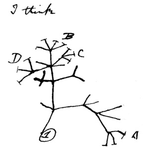
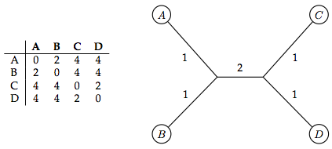
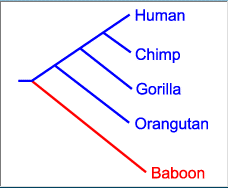
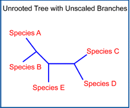
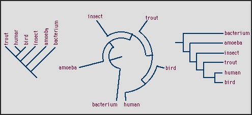
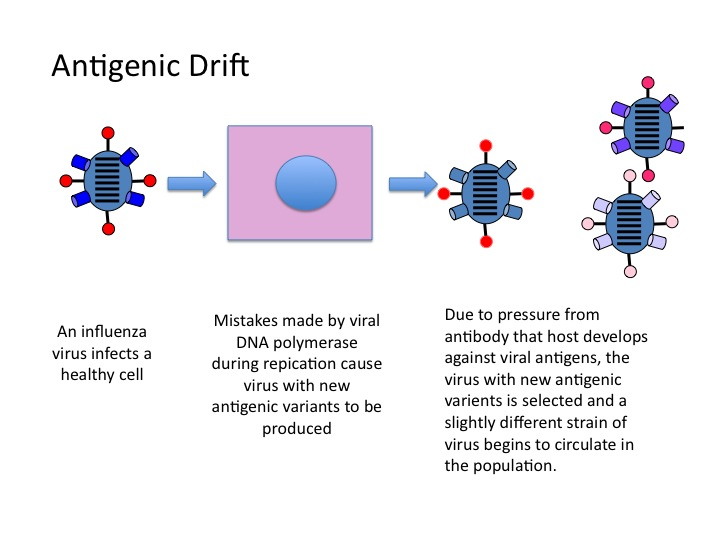
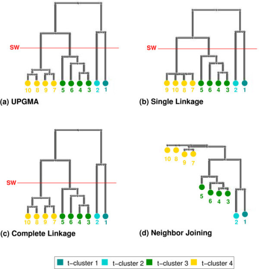

---
output:
  html_document: default
  pdf_document: default
---
<p style="text-align: center;">[Phylogenetic tree construction in R]{style="font-size:250%; font-weight:400"}</p>

<p style="text-align: center;">[*Chapter 14*]{style="font-size:120%; font-weight:400"}</p>

&nbsp;

As in previous weeks, for today's lab you are to create a new `RMarkdown` document using the class lab report template. Within your `.Rmd` document, include all you code, resulting plots, and answers to questions below. 

When you are done with your report, use knitr to convert it to .PDF format to submit on Canvas. 
It is important that you document each step of your workflow using comments and that you break up the sections of your analysis into SEPARATE code chunks.

&nbsp;

# **Today's investigation** 

In this module, we will learn about phylogenetic trees and how to recontruct them using three different methods in `R`. We will download and manipulate a small data set on seasonal influenza isolate samples in the US from 1993-2008. We will describe and show examples of how each of these approaches work and how to interpret and visualize the results for each using different aspects of phylogenetic tree aesthetics.. This Chapter was adapted from a module by Brandon Güell, Dani Antos, Isabella Muratore, and Christopher A. Schmitt. 

&nbsp;

##### [Materials and Methods]{style="color:#66023C; font-size:150%; font-weight:600"}

-   R and RStudio
-   packages *stats*, *ade4*, *ape*, *adegenet*, *phangorn*, and *RevGadgets*
-   data <a href="https://github.com/jenna-tb-ekwealor/Biostatistics_laboratory/blob/master/Materials/flu.fasta" target="_blank">flu.fasta</a>, <a href="https://github.com/jenna-tb-ekwealor/Biostatistics_laboratory/blob/master/Materials/annot.csv" target="_blank">annot.csv</a>, and <a href="https://github.com/jenna-tb-ekwealor/Biostatistics_laboratory/blob/master/Materials/flu_Bayesian_output" target="_blank">flu_Bayesian_output</a>

&nbsp;

***

##### [Packages]{style="color:#66023C; font-size:150%; font-weight:600"}

First install these packages by running the following command in the *console* (usually in the bottom left panel in RStudio). 

```
packages <- c("stats", "ade4", "ape", "adegenet", "phangorn", "RevGadgets", "ggtree")
install.packages(packages)
```

&nbsp;

``` r
library(adegenet)
library(phangorn)
library(stats)
library(ade4)
library(ape)
library(adegenet)
library(phangorn)
library(RevGadgets)
library(ggtree)
```

&nbsp; 

<center> 

{width=40%}

</center>

&nbsp; 

Phylogenetic trees are useful diagrams which show inferred evolutionary relationships of a set of organisms, or a set of traits within a group of organisms. Phylogenetic tree reconstructions are made from analysis of observed heritable traits, commonly DNA sequences, previously morphological characters, in order to estimate common ancestors between taxa and sometimes times of divergence. Trees can represent evolutionary divergence according to information from entire genomes, or from one gene or a set of genes. Commonly, the so-called DNA barcode, part of the sequence for the highly conserved cytochrome oxidase subunit one has been single-handedly used to construct trees. This electron transport chain component is useful because very few mutations persist in fit organisms, so those that stick are very solid predictors of differences between lineages.

&nbsp; 

Almost all phylogenetics methods start with a distance matrix in which differences between taxa are estimated by summing discrepancies in nucleotides or quantified morphological characters:

&nbsp; 

<center> 

{width=50%}

</center>

&nbsp; 

This matrix is the direct basis for the simplest kind of tree, called UPGMA, or unweighted pair group method using arithmetic mean. Another form of simple tree building is called neighbor joining and is considered more reliable. Neighbor joining mehtods produce unrooted trees unless you take further steps to root the tree, while UPGMA produced a rooted tree. Perhaps the most important difference between these two is that UPGMA assumes a constant rate of evolution AKA nucleotide substitution everywhere and over time. Neighbor joining does not make this assumption.

When phylogenetics first came into vogue, most scientists used small sets of morphological features to predict the relationships between small groups of organisms and most of them built Bayesian trees, based upon Bayes’ Theorem.

However as biological observations became more complex, most people switched over to “frequentist” methods, such as parsimony, due to the large amount of computational power that would be required to resolve Bayesian phylogenies for larger data sets.

Towards the latter half of the 20th century, most biologist began to agree that Bayesian methods created more realistic trees, due to their relative resistance to problems such as long-branch attraction, among other issues. The advent of computing technology once again made these methods feasible. However, many scientists bitterly resisted this transition, resulting in intellectual conflicts.

&nbsp;

#### Phylogenetic Drama

One such conflict has been called <a href="https://www.wired.com/2016/02/twitter-nerd-fight-reveals-a-long-bizarre-scientific-feud/"> “Parsimony-gate”</a>. This involved the traditionalist editors of the well-known journal “Cladistics” publishing an editorial discouraging the use of Bayesian methods in journal submissions when parsimony could be used. Subsequently, many biologists criticized the article on twitter, only to receive aggressive responses from the original author.

&nbsp;

*****

<p style="text-align: center;">[Types of phylogenetic trees]{style="color:darkblue; font-size:300%; font-weight:400"}</p>

## {.tabset .tabset-pills}

### Rooted
Rooted phylogenetic trees imply relationships about the most recent common ancestor. This information is given by showing an “outgroup” which is the most basal extant ancestor in a given tree. Each node thus represents the most recent common ancestor for each set of taxa which meet at that node.

<center>
{width=30%}
</center>

### Unrooted
Unrooted phylogenetic trees are similar to rooted trees in that each node represents the most recent comon ancestor between groups. However, it differs in that it does not give information or imply any ancentral “root” or basal outgroup.

<center>
{width=30%}
</center>

### Tree Drawing Styles
phylogenetic trees can also be drawn differently. The trees below all show the same relationships between the taxa, just in different aesthetically pleasing ways.

<center>

{width=60%}

</center>

*****

&nbsp;


## Four methods of phylogenetic tree reconstruction: {.tabset .tabset-pills}

### Distance-based
Distance based phylogenetic trees are pretty much exactly what they sound like: we find the "genetic distance" between pairs of taxa and cluster the species using the distances. Pairs with shorter distances are clustered more closely together than pairs with large distances. Because making distance-based trees is usually requires an algorithm to compute the pairwise distances, the trees produced can be rooted or unrooted depending on the algorithm used (we'll go into this a litter later). **Advantages** of this method? It's fast and flexible. **Disadvantages**? The tree produced can change based on the algorithm we choose, and we can't test to make sure that we're using the best model, so the tree can be inaccurate.

### Maximum parsimony
Maximum parisomy phylogenetic trees aim to minimize the number of character-state changes in a tree. Thus, this usually produces the simplest possible trees with the least amount of branches (i.e. character-state changes). The method is composed of 1) initiating an algorithm using a tree and 2) making small changes to the tree by simplifying relationships until we are left with the most parsimonious tree and no futher simplifications can be made.

### Likelihood-based
Maximum likelihood is considered a type of likelihood based tree construction, a group to which Bayesian methods also belong. Maximum likelihood maximizes the chances of collecting the data set in question given that the calculated tree, along with parameters describing evolutionary rules, are true. Mathematically this is represented as:

P(D|M)

Where P = probability, D = observed data, and M = model

A common way of understanding this approach is to to say whether an observed set of coin flips (**the data**) is more likely under **the model** that the coin is fair, or that it is biased. 

Maximum Likelihood favors minimizing the number of mutations at "internal nodes", AKA divergence points, inside a tree. This is based on the assumption that the fewest number of possible substitutions to get from sequence version A to sequence version B is most likely what actually happened. In reality this is not always true of course.

### Bayesian-based

Bayesian methods, like maximum likelihood, use the likelihood in tree construction. However, in Bayesian analyses, Bayes' theorem is utilized to assess the probability of a tree model given the observed data. Mathematically, this is expressed as:

P(M|D) = [ P(D|M) x P(M) ] / P(D)

Where P = probability, D = observed data, and M = model

Continuing with the coin toss example, in this framework we would use a set of observed coin flips (**the data**) to determine whether the coin is more likely to be fair or biased (**the model**).

**Bayesian inference, compared to maximum likelihood, offers several advantages:**

- One of the main advantages is the ability to **incorporate prior knowledge** into the inference. Bayesian inference allows researchers to incorporate prior beliefs or information about the parameters of the model. This can be particularly beneficial when dealing with limited data or when there is existing knowledge about the system being studied. Maximum likelihood, on the other hand, typically relies solely on the observed data. 
- A second major advantage is that Bayesian inference provides a natural framework for **estimating uncertainty** in parameter estimates and model predictions. By sampling from the posterior distribution of parameters, researchers can obtain credible intervals and posterior probabilities, which convey the degree of uncertainty in the estimates. Maximum likelihood, while providing point estimates of parameters, does not inherently quantify uncertainty. 
- Other advantages include flexible model selection, handling complex models, and robustness to sparse data.

## {-}

*****

##### Useful skills we will go over today:
* Importing data on DNA sequences in a phylogenetic tree format
* Phylogenetic tree reconstruction using various methods in R
* Plotting and interpret results from trees constructed
* Test for molecular clock and estimates rates of evolution
* Use bootstrapping for examining tree topology/organization reliability

*****

&nbsp;

<p style="text-align: center;">[Getting Started]{style="color:darkblue; font-size:300%; font-weight:400"}</p>

#### Read in the DNA sequences of seasonal influenza (H3N2)

We’re using the DNA sequences for a set of different influenza strains collected from 1993 to 2008 in the US (get your flu shot every year!)

The data for today's lab is organized into two files: 1) the DNA sequences (flu.fasta) and 2) the annotations (annot.csv). We’ll start by loading the DNA sequences data using the function `fasta2DNAbin()` from the `adegenet` package. FASTA is a universally used sequence file format that we will later convert to the format used by the `phangorn` package. Let’s name this dataframe dna. We can call this dataframe and see that it is organized in a matrix in binary format and contains 80 DNA sequences.

``` r
dna <- adegenet::fasta2DNAbin(file="flu.fasta")
dna
```

&nbsp;

Flus evolve rapidly compared to some other viruses, and this occurs mostly due to mutations accumulated in the membrane proteins. We will see whether this fact shapes how our trees turn out.

<center>
{width=70%}
</center>

&nbsp;

We can read in the annotation file in R using the following code:

``` r
annot <- read.csv("annot.csv", header=TRUE, row.names=1)
```

&nbsp;

<p style="text-align: center;">[Distance-based methods]{style="color:darkblue; font-size:300%; font-weight:400"}</p>

&nbsp;

Just to recap on some background mentioned earlier: Distance-based trees are produced by calculating the genetic distances between pairs of taxa, followed by hierarchical clustering that creates the actual “tree” look. While there are tons of algorithms to choose from when computing distances, there are two popular clustering methods that are used most frequently.

1. UPGMA- this is the simplest method for constructing trees, assumes the same evolutionary speed for all lineages (which can be a disadvantage); all leaves have the same distance from the root (creates ultrametric tree)

2. Neighbor-joining- taking the two closest nodes of the tree and defines them as neighbors; you keep doing this until all of the nodes have been paired together

The following figure can help visually distinguish UPGMA methods from neighbor-joining methods (you can ignore single linkage and complete linkage)


<center>
{width=60%}
</center>

&nbsp;

There are 3 basic steps for Distance-Based Phylogenies:

1. Find genetic distances for pairs of individuals (in our case, isolates)

2. Make a tree using these distances

3. Evaluate the relevance of the tree

&nbsp;

### Step 1

The function `dist.dna()` from the package `ape` computes a matrix of pairwise "distances" from DNA sequences using a particular DNA substitution model. 
A DNA substitution model describes the substitution of genetic variation across samples by modeling factors such as mutation rates, genetic drift, migration, and selection pressures. 
The genetic distances between flu strains are here calculated using a model published by Tamura and Nei (1993). This model says that transitions (purine to purine or pyrimidine to pyrimidine) and transversions (purine to pyrimidine or vice versa) may happen at different rates, that not every nucleotide appears at the same frequency, and that the rate of substitution can vary between different regions of the sequence. Alternatives to this model include the Jukes-Cantor model in which all types of nucleotide substitutions are equally probable.

``` r
D <- dist.dna(dna, model = "TN93")
```

&nbsp;

For n number of samples, you can calculate the number of pairwise distances with n(n-1)/2. 

##### **Questions:**

1. How many sequences do you have? 

2. Calculate the number of pairwise distances using teh formula above. How does that compare to the number of distances in `D`?

&nbsp;

Let's plot these pairwise distances on a heatmap, where a color gradient or ramp symbolizes genetic distance. 
The `table.paint()` function requires a data frame in which each column and each row represents a sample, and each cell has a distance value. However, if you take a look at `D` you will see it is a vector.
First we turn `D` into a matrix, then into a data frame to get it in the right format for `table.paint()`.

``` r
D_df <- as.data.frame(as.matrix(D))
table.paint(D_df, cleg=0, clabel.row=.5, clabel.col=.5) 
```

Here, darker shades of gray mean a larger distance. There are other functions in other packages that can make much fancier heat maps!

We can start to see a pattern in the heat map because the data is ordered by year, but we can't really make any conclusions yet.

&nbsp;

That was step 1 in its entirety, so it’s pretty easy because we have a nice function that computes all of our distances for us. The darker colors indicate larger distances, so, while we have some data about the genetic differences between a pair of species, we aren’t quite ready to draw massive conclusions yet.

<center>
{width=60%}
</center>

### Step 2

Building the tree generally just gives us a better visual understanding of what’s going on. 
As I mentioned previously, the figure from Step 1 shows us that there is a trend or pattern of some sort, but it’s difficult to get more than that just from the figure. 
On the other hand, we can’t always assume that a tree is the best or most efficient representation of our genetic distances.

&nbsp;

`R` has a ton of algorithm options for us to choose from to make our tree:

- `nj()` from `ape` package: classic Neighbor-Joining algorithm

- `bionj()` from `ape` package: Neighbor-Joining 2.0 (basically)

- `fastme.bal()` AND `fastme.ols()` both from `ape` package: minimum evolution algorithm (to my understanding, usually looks the same as neighbor joining, topology shows the smallest value of branch sums)

- `hclust()` from `stats` package (a base package in `R`): classical hierarchical clustering, including UPGMA and others

&nbsp;

Let's generate a neighbor-joining tree from our distance matrix `D` using the `ape` package. 
As we saw before, trees created using `ape` package will be of class phylo: 
``` r 
tre <- nj(D)
tre
class(tre) 
```

&nbsp;

"Ladderizing" a tree simply rotates the nodes so that it organizes branches by lengths, generally thought to make it easier to look at. 

``` r
tre <- ladderize(tre, right = F)
```

&nbsp;

First plot the tree with base `R` `plot()` function: 
``` r
plot(tre, cex = 0.6)
title("A Simple NJ Tree")
```

&nbsp;

Here is the same distance matrix but assembled into a tree with a different algorithm. 
Using the `hclust()` function, `method = "average"` is used for UPGMA. 

``` r
h_cluster <- hclust(D, method = "average", members = NULL)
plot(h_cluster, cex = 0.6)
```

&nbsp;

[Challenge 1]{style="color:#66023C; font-size:150%; font-weight:600"}

Try the other three functions out on your own! 

&nbsp;

##### **Questions:**

3. How do the resulting trees compare to these two examples?

4. Do you think one is better than the rest?

&nbsp;

The two previous examples show the simplest types of trees that we can make, but you can also add annotations, labels, and colors to make the tree easier to interpret.
For example, we can use colors to represent different years, grabbing data from the annotation dataset, `annot.csv`.
Here, we first remove the default tip labels so that we can replace them with our own tip labels. 

&nbsp;

The `colorRampPalette()` function in the `grDevices` package takes a certain set of colors and returns new color palettes or color “ramps” to map an interval. In other words, we are providing 4 colors below but it will generate gradients between those colors, too. 

The `tiplabels()` function in the `ape` package adds labels to or near nodes/edges of a tree. 

The `num2col()` function in the `adegenet` package can translate variables onto a color scale. 

The function `pretty()` computes a sequence of equally spaced values that encompass the range of x values. 

&nbsp;

``` r
plot(tre, show.tip = FALSE) 
title("Unrooted NJ tree")

# define a color ramp 
myPal <- colorRampPalette(c("red","yellow","green","blue"))

tiplabels(annot$year, bg = num2col(annot$year, col.pal = myPal), cex=.5) 

# set the boundaries between colors 
breaks <- pretty(1993:2008, 5)
legend("bottomright", fill = num2col(breaks, col.pal = myPal), leg = temp, ncol = 2)
```

The tree is now easy to read with the color coding, but the location of some of the isolates can be misleading since the true is not actually rooted---we may not know the polarity of these changes. 

Use the function `ape::is.rooted()` to see that the tree is not rooted. 

To overcome this deception we can re-draw the tree in a way that makes the unrootedness explicit:

``` r
plot(tre, type = "unrooted", show.tip = FALSE)
title("Unrooted NJ Tree")

tiplabels(tre$tip.label, bg = num2col(annot$year, col.pal = myPal), cex = 0.5)
```

&nbsp;

Though, the best case is that we *do* know how to root the tree. 
In any phylogenetic analysis, it's important to include outgroups that you are confident are the most distant relative of all the other samples.
For this dataset, we can root by any of the oldest isolates. 
We can use the annot dataset again to find that.

&nbsp;

[Challenge 2]{style="color:#66023C; font-size:150%; font-weight:600"}

View `annot` and find an old sample to root the tree with using the function `ape::root()`. Plot the tree, color-coded as above, but properly rooted. 
Use `axisPhylo()` to add an axis to your tree. 

&nbsp;

### Step 3

Because there are so many different algorithms to choose from when constructing our tree, we have to make sure the one we chose was appropriate for our dataset, using our original distance matrix (in this case, `D`). 
This is much easier than it sounds, and just requires some plots and correlation calculations.
Here, we'll use the `cophenetic()` function from the `stats` package. 
This function computes distances between the tips of the trees. 

``` r
x <- as.vector(D)
y <- as.vector(as.dist(cophenetic(tre2)))

plot(x, y, xlab="original pairwise distances", ylab="pairwise distances on the tree", main="Is NJ appropriate?", pch=20, col=transp("black",.1), cex=3)
abline(lm(y~x), col="red")
```
Do the appoints appear to fall along the line? We can test the correlation with the function `cor()`:

``` r
cor(x,y)^2
```

This graph can be read similarly to a QQ plot, so in this case we can say that, yes, the Neighbor-Joining tree is a good representation of our genetic distances.

&nbsp;

[Challenge 3]{style="color:#66023C; font-size:150%; font-weight:600"}

Plot pairwise distances for tree vs. sequences for the UPGMA tree, and assess the strength of correlation.

&nbsp;

##### **Questions:**

5. Which tree model is a better fit for your data?

6. Re-visit the NJ and UPGMA tree plots and hypothesize why one might be a better fit than the other. *HINT* note that the UPGMA tree is an **ultrametric** tree, meaning that we assume that all isolates have gone through the same amount of evolution. 

&nbsp;    

*** 

<p style="text-align: center;">[Bootstrapping]{style="color:darkblue; font-size:300%; font-weight:400"}</p>

Similar to all other instances when bootstrapping can be used, here, bootstrapping a phylogeny can be used to validate the tree.

To validate our tree, we sample our nucleotides with replacement and rebuild the tree. If our tree is appropriate, the nodes in the original tree and the nodes in the bootstrapped tree should be the same.

From the `ape` package, the function `bootphylo()`  performs the bootstrap, while the function `nodelabels()` adds the labels to or near the nodes.

``` r
myBoots <- boot.phylo(tre2, dna, function(e) root(nj(dist.dna(e, model = "TN93")),1))
myBoots
```

&nbsp; 

Let's plot the NJ tree with bootstrap values: 
``` r
plot(tre2, show.tip = FALSE, edge.width = 2)
title("NJ tree + bootstrap values")

tiplabels(frame = "none", pch = 20, col = transp(num2col(annot$year, col.pal = myPal),.7), cex = 3, fg = "transparent")
axisPhylo()

breaks <- pretty(1993:2008, 5)
legend("bottomright", fill = transp(num2col(breaks, col.pal = myPal),.7), leg = breaks, ncol = 2)

nodelabels(myBoots, cex = .6)
```

&nbsp;

The numbers shown by `nodelabels()` is just the number of times each node appeared in the bootstrapped trees (remember, bootstrapping means that we’re running the analysis numerous times, not just recreating the tree once). Let’s assume bootstrapping recreated the phylogeny 1000 times. The numbers by each node are pretty low, meaning there’s not a huge overlap between the nodes in our original tree and the nodes in the bootstrapped tree. What does this mean? Basically, it means that some of the nodes aren’t supported.

How do we overcome this and fix our tree? We can collapse some of the smaller branches, which will make the tree less informative but more concrete.


``` r
temp <- tre2
N <- length(tre2$tip.label)
toCollapse <- match(which(myBoots<70)+N, temp$edge[,2])
temp$edge.length[toCollapse] <- 0
tre3 <- di2multi(temp, tol=0.00001)
plot(tre3, show.tip=FALSE, edge.width=2)
title("NJ tree after collapsing weak nodes")
tiplabels(tre3$tip.label, bg=transp(num2col(annot$year, col.pal=myPal),.7), cex=.5, fg="transparent")
axisPhylo()
temp <- pretty(1993:2008, 5)
legend("bottomright", fill=transp(num2col(temp, col.pal=myPal),.7), leg=temp, ncol=2)
```

&nbsp;

<p style="text-align: center;">[Maximum parsimony methods]{style="color:darkblue; font-size:300%; font-weight:400"}</p>

To use the maximum parsimony phylogenetic tree reconstruction methods, we will need a tree in `ape`’s format: as a `phylo` object and the original DNA data sequences in a format from the `phangorn` package: `phyDat.` Let’s begin!

First assign the original DNA sequences data as a phyDat object and check class to ensure the change
``` r
dna2 <- as.phyDat(dna) 
class(dna2) 
dna2
```

Next, we will reconstruct a tree using the `nj()` function as we saw before. This will be a starting tree to get us to the most parsimonious tree. 

``` r
tre.ini <- nj(dist.dna(dna,model="raw"))
tre.ini
```

We can then measure this tree’s parsimony using the function `parsimony()` from the `phangorn` package.

``` r
phangorn::parsimony(tre.ini, dna2)
```

Lastly, the function which which will algorithmically make our tree the most parsimonious possible is the `otim.parsimony()` function. Lets use it below on our newly reconstructed tree and see what happens.

``` r
tre.pars <- optim.parsimony(tre.ini, dna2)
tre.pars
```

``` r
parsimony(tre.pars, dna2)
```

The result is a very similar tree to the one before, but its final “p-score” is 2 values lower than before. Thus, although not by much, this newly made tre.pars phylogenetic tree is our most parsimonious tree.

Again, we can plot this tree similarly as before.

This function takes a vector of color labels and makes them applicable to groups on a tree:

``` r
myPal <- colorRampPalette(c("red","yellow","green","blue"))
```

Finally, let's plot the tree in the same style we did before. 

``` r
plot(tre.pars, type  = "unr", show.tip = FALSE, edge.width = 2)
title("Maximum-parsimony tree")

tiplabels(tre.pars$tip.label, bg = transp(num2col(annot$year, col.pal = myPal),.7), cex = .5, fg = "transparent")
breaks <- pretty(1993:2008, 5)
legend("bottomright", fill = transp(num2col(breaks, col.pal = myPal),.7), leg = breaks, ncol = 2, bg = transp("white"))
```

Again, our tree is unrooted and has no branch lengths. We can likely attribute the similarity in results in our parsimonious tree to the other methods we used before to the fact that there is little divergence between the sequences in our data.

&nbsp;

<p style="text-align: center;">[Maximum Likelihood-based methods]{style="color:darkblue; font-size:300%; font-weight:400"}</p>

Let’s prepare to build a maximum likelihood (ML) tree.

First, we build a simple neighbor-joining tree that we can hand to the `ape` package in order to turn it into maximum likelihood. There is (generally non-`R`) software that will built a ML tree straight from sequence data, and that's generally what's used, but we'll use this for demonstration purposes. 

&nbsp;

As before, we will use the TN93 (Tamura-Nei 1993) model, which allows for different transition rates, heterogenous base frequencies, and variation of substitution rate at the same site. 

``` r
tre.ini <- nj(dist.dna(dna,model = "TN93"))
```

&nbsp;

`pml()` calculates the likelihood of the data given the model, initially just using our neighbor joining tree:
``` r
pml(tre.ini, dna2, k = 4)
```

The above calculation may have failed if the loglikelihood is listed as NaN. This would likely be caused by missing sequence data.

Using `table()` we can look at the number of occurences of the difference bases according to their <a href="https://www.dnabaser.com/articles/IUPAC%20ambiguity%20codes.html">(IUPAC ambiguity codes)</a>. In a typical FASTA file, bases that could not be sequenced accurately are listed as “N” and a number of other letters can indicate a lesser degree of uncertainty such as “Y” to indicate that the base must be a pyramidine, etc.

``` r
table(as.character(dna2))
```

&nbsp;

Since we think there is a problem with missing bases, we use `na.posi()` to search for any bases that are not listed as A, T, G, or C.

``` r
na.posi <- which(apply(as.character(dna),2, function(e) any(!e %in% c("a","t","g","c"))))
```

&nbsp;

Due to the nature of sequencing techniques, sometimes sequences have poorer quality in a particular area such as the very beginning or very end. Therefore, we will plot the frequency of non-ATCG bases over their position in the sequence.

``` r
temp <- apply(as.character(dna),2, function(e) sum(!e %in% c("a","t","g","c")))
plot(temp, type = "l", col = "blue", xlab = "Position in HA segment", ylab = "Number of NAs")
```

&nbsp;

Due to the majority of the missing data appearing in the start of the sequence, we can infer that this was caused to differences in overall length between strains due to sequence divergence (i.e. your flu shot from 2 years ago may not work as well anymore!).

We can exclude the missing data:

``` r
dna3 <- dna[,-na.posi]
```

&nbsp;

Now it looks complete:

``` r
table(as.character(dna3))
```

&nbsp;

Now we can convert back to `phangorn` format:

``` r
dna4 <- as.phyDat(dna3)
```

&nbsp;

We can make the NJ tree again, and use `pml()` again to calculate likelihood:

``` r
tre.ini <- nj(dist.dna(dna3,model="TN93"))
fit.ini <- pml(tre.ini, dna4, k=4)
fit.ini
```

&nbsp;

Now we can optimize the tree, using options to also optimize tree topology (`optNni`), base frequencies (`optBf`), and substitution rates (`optQ`). We will use a gamma distribution (`optGamma`) for variation in substitution rates at different sites in the sequence:

``` r
fit <- optim.pml(fit.ini, optNni=TRUE, optBf=TRUE, optQ=TRUE, optGamma=TRUE)
fit
```

&nbsp;

Let’s compare the optimized tree to the neighbor joining tree using an anova:

``` r
anova(fit.ini, fit)
```

&nbsp;

The anova shows a significant difference between the two trees. We can use the AIC, as discussed in previous modules, to see which is a better model for the data.

``` r
AIC(fit.ini)
AIC(fit)
```

Since a lower AIC value is better, we can see that the optimized tree worked better than the neighbor joining tree.

&nbsp;

Now we plot the tree using the same methods as before:

``` r
tre4 <- root(fit$tree,1)
tre4 <- ladderize(tre4, right = F)

plot(tre4, show.tip = FALSE, edge.width = 2)
title("Maximum-likelihood tree")

tiplabels(annot$year, bg = transp(num2col(annot$year, col.pal = myPal),.7), cex = .5, fg = "transparent")
axisPhylo()

breaks <- pretty(1993:2008, 5)
legend("bottomright", fill = transp(num2col(breaks, col.pal = myPal),.7), leg = breaks, ncol = 2)
```

&nbsp;

##### **Questions:**

7. Given that we know flus evolve rapidly, does this tree shape makes sense? *HINT:* Think about how you would expect mutations to occur over time. 

&nbsp;

***

<p style="text-align: center;">[Bayesian phylogenetic methods]{style="color:darkblue; font-size:300%; font-weight:400"}</p>

In truth, `R` is not the best language for Bayesian phylogenetics, which rely on Markov chain Monte Carlo (MCMC). However, what it's great for, is post-processing and visualization of results. 

Here we'll start with output from a simple tree infrence of the flu data set in <a href="https://revbayes.github.io">RevBayes</a>, a Bayesian langauge for phylogenetics. In this analysis, we used the <a href="https://revbayes.github.io/tutorials/ctmc/#the-general-time-reversible-gtr-substitution-model">general time reversible (GTR)</a> nucleotide subsitution model, which considers all possible types of nucleotide substitutions and allows for different rates of substitution between nucleotides. This model accounts for the complexities of nucleotide evolution more comprehensively than simpler models, making it more accurate for analyzing DNA sequences.

&nbsp;

### Load output

`RevGadgets` provides several tools that facilitate the visualization of posterior distributions of parameters. The output of most RevBayes analyses is a tab-delimited file where rows correspond to samples of an MCMC analysis and columns correspond to parameters in the model. Most information of interest to researchers must be extracted from these output files.
Visualizing MCMC output is also critical for evaluating and troubleshooting analyses, especially for diagnosing MCMC pathologies.

Let's read in and process the trace file. Burnin (the samples taken before the Markov chain reached stationarity) may be removed at this stage or after examining the trace file further.

``` r
# specify the input file
logfile <- "flu_Bayesian_output/flu_GTR.log"

# read the trace and discard burnin
trace_quant <- RevGadgets::readTrace(path = logfile, burnin = 0.1)
```

&nbsp;

The function `SummarizeTrace()` from `RevGadgets` calculates the mean and 95% credible interval for quantitative variables and the 95% credible set for qualitative variables. In this nucleotide substitution model, the expected proportion of each nucleotide has it's own "stationary frequency" which is the long-term proportions of nucleotides or amino acids expected at each site in a sequence alignment. Here, the frequences are represented as `pi` 1 through 4 for A, C, G, T, respectively. 

To examine the stationary frequency parameter values in our trace file, summarize their distributions, which will be printed:

```r
summarizeTrace(trace = trace_quant, vars =  c("pi[1]","pi[2]","pi[3]","pi[4]"))
```

&nbsp;

Then plot these distributions. `RevGadgets::plotTrace()` produces a list of ggplot2 objects, with multiple plots if there are multiple runs in the trace object or if you provide a mix of quantitative and qualitative parameters. Here, only one plot is produced, so we print the plot using [[1]] after the function call.


``` r
plotTrace(trace = trace_quant, vars = c("pi[1]","pi[2]","pi[3]","pi[4]"))[[1]]
```

&nbsp;

### Visualizing RevBayes Phylogenies

`RevGadgets` reads and processes single trees and tree traces with `readTrees()`:

``` r
treefile <- "flu_Bayesian_output/flu_GTR_MAP.tre"
tree_bayes <- readTrees(paths = treefile)
```

&nbsp;

##### **Questions:**

8. Approximately what proportion was each nucleotide inferred to be? Does this make sense? Why or why not?

9. What is the class of `tree_bayes`? How does this compare to trees earlier in this lab chapter?

10. Inspect and investigate the `tree_bayes` object until you find a phylo object. What command would you use to access it directly?

&nbsp;

Since `RevBayes` trees are a slightly different structure than trees from before, it's useful to use the `RevGadgets` package when you want to modify the tree, such as to reroot and plot it:

``` r
tree_rooted <- rerootPhylo(tree = tree_bayes, outgroup = "CY013200")
plot <- RevGadgets::plotTree(tree = tree_rooted,
                 # label nodes the with posterior probabilities
                 node_labels = "posterior", 
                 # offset the node labels from the nodes
                 node_labels_offset = 0.005,
                 # make tree lines more narrow
                 line_width = 0.5,
                 # italicize tip labels 
                 tip_labels_italics = TRUE)
```

&nbsp;

In a Bayesian analysis, it is not bootstrap values that show support of each node, but the **posterior probability** (recall Bayes' Theorem). Let's plot again, with posterior probabilities on the nodes, and ths time removing tip labels so it's a little easier to look at:

``` r
plot <- RevGadgets::plotTree(tree = tree_rooted,
                 # make tree lines more narrow
                 line_width = 0.5,
                 tip_labels_size = 0,
                # label nodes the with posterior probabilities
                 node_labels = "posterior", 
                 # offset the node labels from the nodes
                 node_labels_offset = 0.001, 
                 node_labels_size = 2,
                 ladderize = T) 
plot
```

&nbsp;

RevGadgets tree plots are compatible with the functions from the package `ggtree`, which has similar structure and syntax as `ggplot2`, which you are familiar with by now. Let's use `ggtree` to add color-coded tip labels as before.

First, we will add a column to `annot` that defines the color for each tip, as before:

``` r
hexcolors <- unique(transp(num2col(annot$year, col.pal = myPal),.7))
```

&nbsp;

Next we will use a new function, `%<+%`, to *add* the annotation file (`annot`) to the tree, then access the year and hexcolor columns:

``` r
plot %<+% annot +
  geom_tiplab(aes(color = factor(year)), size = 1.8, fontface = "bold") +
  scale_color_manual(values = hexcolors, guide = "none") 
```

***


**Great Work!**

&nbsp;

***

This lab activity was originally written by Brandon Güell, Dani Antos, Isabella Muratore (with modifications by Christopher A. Schmitt (see <a href="https://fuzzyatelin.github.io/bioanth-stats/module-24/module-24.html">https://fuzzyatelin.github.io/bioanth-stats/module-24/module-24.html</a> and further modified by Jenna Ekwealor. The RevGadgets section was adapted from <a href="https://revbayes.github.io/tutorials/intro/revgadgets.html">the RevGadgets tutorial</a> by Carrie M. Tribble and Michael R. May. 


